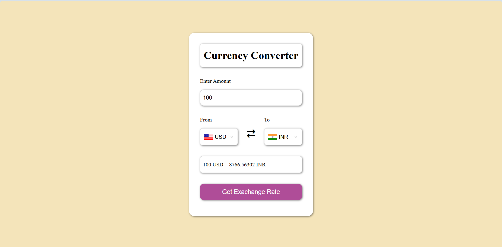

# Currency-Converter

## 🌐 Live Demo

Check out the live version of the Currency Converter app here:  
[https://nit-currency-converter.netlify.app/](https://nit-currency-converter.netlify.app/)

🌍 Currency Converter

A real-time, dynamic currency converter web application that allows users to convert amounts between any two world currencies instantly. This project leverages the free Fawaz Ahmed Exchange API
 to fetch up-to-date exchange rates for over 200 currencies including fiat, crypto, and metals.

📝 Features

Convert any amount between any two currencies.

Supports all world currencies, dynamically loaded from the API.

Displays country flags for the selected currencies.

Responsive and user-friendly interface.

Automatic default conversion from USD → INR.

Error handling for unsupported currencies or network issues.

⚡ How it Works

The user selects From and To currencies from dropdowns.

The application fetches the latest exchange rates from the exchange-api.

The conversion rate is applied to the entered amount, and the result is displayed.

Flags are updated dynamically based on the selected currencies.

🛠 Technologies Used

HTML5 for the structure.

CSS3 for styling and responsive design.

JavaScript (ES6) for dynamic interaction and API integration.

Exchange API for fetching real-time currency rates.

FlagsAPI for displaying country flags.